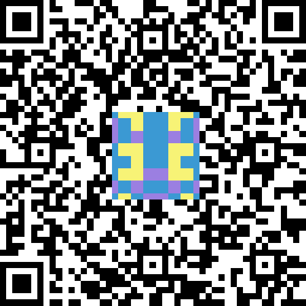
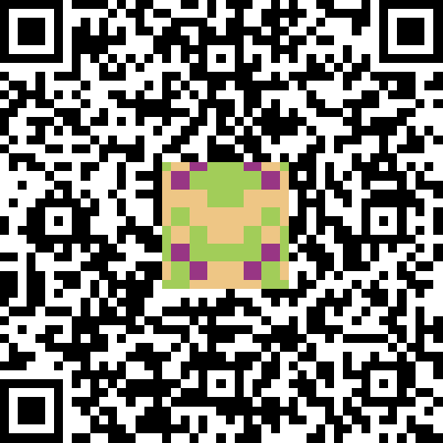

# IdentiQR

QR Codes with identification icons It's made for IOTA and for use with <https://github.com/peterwilli/IOTA-tangle-explorer>, but distributed as a separated module for use in other projects. I did this to try and make this a de-facto standard for sharing IOTA addresses with a QR code.

## How to install

In plain HTML, just include the JS file and put in the following code in your HTML file:

```
<script src="path/to/identi-qr.js"></script>
```

If you use React, VueJS or Webpack, you can `require()` by putting identi-qr.js inside your projects src (or similar) folder and call `const IdentiQr = require('path/to/identi-qrcode.js')`

## Usage

Create a div, like this: `<div id='qr'></div>`

In JS, call:

```
this.qrcode = new IdentiQr(document.getElementById(qr), {
  text: 'sample_hash',
  width: this.size,
  height: this.size,
  correctLevel : IdentiQr.CorrectLevel.M
})
```

Replace sample_hash with anything you like to share as QR code. For an IOTA-address, you could do: `{"address":"SLSQPANQAPYJEOUHSHCRDKCWMPCEIHSNHLOKRZACLQUEKUDSYYQBCQNHFWKQALEHPPJHXQXVOQVEWYGJTXEDXGNMLJ","amount":"","message":"","tag":""}`

## Samples






## Thanks to

- Blockies: <https://github.com/ethereum/blockies>
- QRCodeJS: <https://github.com/davidshimjs/qrcodejs>
